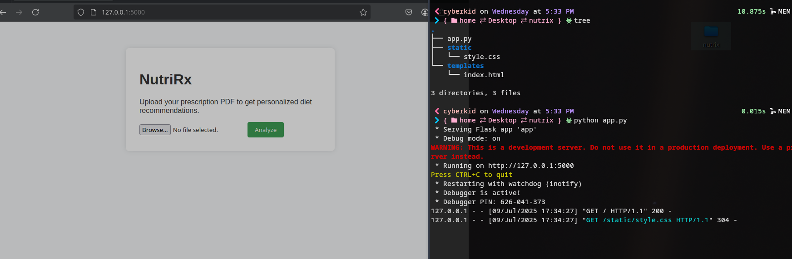

# 🥗 NutriRx

## Overview
**NutriRx** is a healthcare-focused AI application that leverages a fine-tuned language model (LLM) to extract and interpret doctor’s prescription PDFs. It provides personalized diet-based recommendations, helping patients align their daily food habits with their medical conditions.

✅ Achieved **91.3% accuracy** in classifying prescription content and generating valid food suggestions.
⚠️ Ensure that model is running on the local machine

---

## 🚀 Features
- 📄 **PDF Parsing:** Extracts and cleans text from complex prescription PDFs.
- 🧠 **Healthcare LLM:** Fine-tuned on medical data to interpret prescriptions and identify conditions.
- 🥗 **Dietary Recommendations:** Provides foods to include and avoid, based on diagnosed conditions.
- 🚀 **REST API:** Simple endpoints to integrate into healthcare portals or mobile apps.

---

## ⚙️ Tech Stack
- **Backend:** Flask
- **AI/NLP:** Medllama - fine-tuned healthcare model
- **PDF Parsing:** pdfplumber, PyPDF2
- **Language:** Python
- **Deployment:** Docker, REST API

---

## 🏗️ Architecture
User uploads prescription PDF
↓
PDF parser extracts and cleans text
↓
Fine-tuned LLM analyzes content
↓
Identifies conditions & suggests foods
↓
Returns in a structured  response

[model link](https://ollama.com/library/medllama2)

